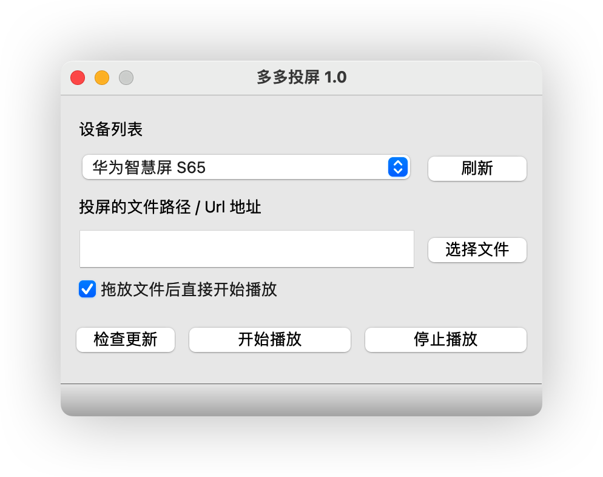
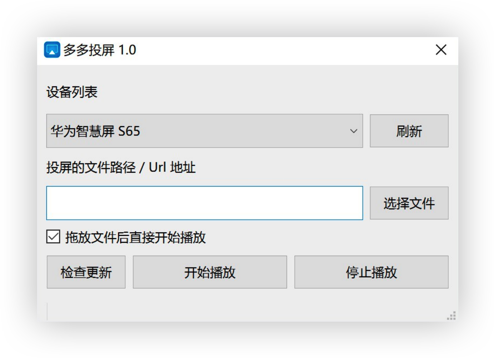

# 新开发的多多投屏 支持进度条 音量控制 

新项目地址 https://github.com/duolabmeng6/projection_screen_tv

前往下载 https://github.com/duolabmeng6/projection_screen_tv/releases

# 下面是旧的内容
# 多多投屏 永久免费 开源软件

轻轻松松在MacOS和Window中将视频文件投屏到电视上,跟手机的投屏功能一致,无需nas等繁琐操作.直接文件投屏.

# MacOS

# Window

# 软件下载

[最新版下载](https://github.com/duolabmeng6/easy_to_tv/releases)

# 运行环境

* Window10
* MacOS
* ~win7~ (由于采用最新的qt6技术所以不支持win7)

电视中需要安装接收端例如

* 当贝投屏 无广告
* ~乐播投屏~ 投屏后有广告恶心人
* 银河奇异果 无广告

# 赞赏

如果觉得项目对你有帮助，可以请作者喝杯咖啡

